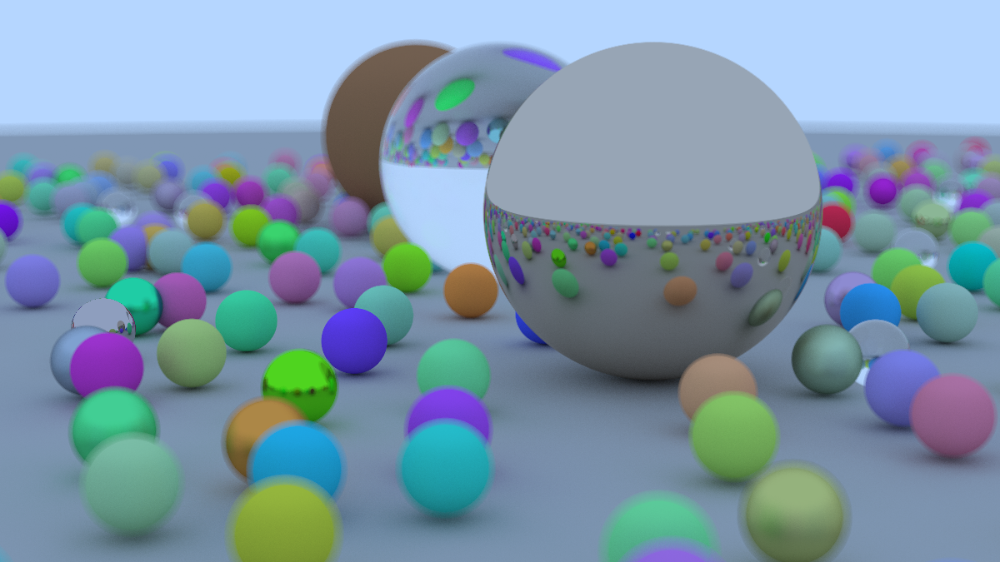

# Ray tracing in a weekend

Implementing [https://raytracing.github.io/books/RayTracingInOneWeekend.html](https://raytracing.github.io/books/RayTracingInOneWeekend.html) in Haskell to see how slow it'll be.

Had to create my own ppm viewer, which is the index.html.

# Generate image

Using a justfile that's set to powershell (since I'm on Windows) to run the cabal script correctly. Takes forever to render the image. For my naive attempt it took about a 1000 seconds, or 15 minutes to run it on 16 cores (!!). That's slow! The plus is that it was easy to parallelize. The minus is that it still takes forever, but at least not a lifetime.

1. First attempt: 1088s
2. Second attempt: 593s // using inline statements for hit, bang patterns and replace list of hittable objects with vector

```bash
just run
```


